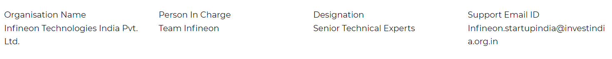

# Infineon AI challenge
Infineon Technologies AG is a world leader in semiconductor solutions that make life easier, safer and greener. Microelectronics from Infineon is the key to a better future. In the 2019 fiscal year (ending 30 September), the company reported sales of around €8 billion with about 41,400 employees worldwide. Infineon is listed on the Frankfurt Stock Exchange (ticker symbol: IFX) and in the USA on the over-the-counter market OTCQX International Premier (ticker symbol: IFNNY).

About this challenge, how easy do you find it to remember the exact location of a presentation that you created last year? Not very easy, right? We deal with hundreds of documents daily and forget about them some time down the line. But what if we want that old presentation again for our your work, but unfortunately you do not remember the name or content of that document to retrieve it from the large storage of your computer. In such cases, we make use of a document finder, which can search for the document of our need based on a query input. This will not only help in faster access to the document, but will also help in grouping similar documents together and in analysing them.

# Stakeholder

##### Detailed Eligibility Criteria
The AI Challenge is open to individuals or as a team of maximum 3 who are passionate about technology in the AI space and is able to offer innovative solutions for the problem statements identified by Infineon

# Problem Statement

#### Intelligent Document Finder
We are looking for an Intelligent Document Finder tool that can provide easy and intelligent searches among the document files. The required document type includes presentations, pdf, doc and txt files. The main idea behind this problem statement is combining human tagging with an automated semantic search for efficient document finding. The tool is supposed to have manual as well as auto tagging capabilities. Once the documents are tagged, the user will enter a few queries in the search page of the tool to look for the most relevant documents.

Visit our github link to get more details.

(https://github.com/altruist7/AIChallenge)

# Incentives

#### Fiscal Incentives
First prize: 3 Gadgets with total worth of up to ₹ 1,50,000
Second prize: 3 Gadgets with total worth of up to  ₹ 50,000
Third prize: 3 Gadgets worth with total wortj of up to ₹ 25,000

#### Non-Fiscal Incentives
Paid pilot to extend the project to a live application, subject to mutually agreed conditions
Opportunity for mentorship with Infineon experts
Internship opportunity at Infineon Technologies

#### Special Category Incentives
Special financial incentive for the best all women team: 3 Gadgets worth total of up to ₹ 30,000

# Timeline

# Organisation Details

# Registration

To participate in the AI Challenge. [Click Here](https://www.startupindia.gov.in/content/sih/en/ams-application/challenge.html?applicationId=5df1b7aae4b04e009527b4b5)

# FAQs

#### What are the terms and conditions?
Terms And Conditions
Terms and Conditions for INFINEON AI CHALLENGE
By registering for the INFINEON AI CHALLENGE ("AI Challenge"), you (whether as an individual for individual participation or on behalf of your team for team participation) agree to the following terms and conditions (“Terms and Conditions”) unconditionally. You shall ensure each of your team members complies with these Terms and Conditions. Any breach of these Terms and Conditions by you or any of your team members may disqualify you and your team from participating in this AI Challenge.

A. Introduction:
1. The AI Challenge is hosted by Infineon Technologies India Private Limited (“Infineon”), and Invest India (“Organizer”) is the official organizer for this AI Challenge.
2. The AI Challenge aims to encourage startups and student entrepreneurs to develop innovative solutions in the area of Artificial Intelligence for real application

B. Eligibility:
1. The AI Challenge is open to individuals who are passionate about technology in the artificial intelligence ("AI") space and is able to offer innovative solutions for the problem statements identified by Infineon. (“Solutions”).
2. Employees of the Organizer, Infineon and other Corporate Partners registered on Startup India Portal and their family members are not eligible to participate in the AI Challenge.
C. Rules of Participation:

Registration
1. An individual or team wishing to register for the AI Challenge (“Participant”) must complete the online registration form and doa full submission at the Startup India Portal, https://www.startupindia.gov.in/ by 31st January 2020, 12 a.m (India time) ("Closing Date")]. A Participant may register to participate in the AI Challenge
individually or as a team with maximum three (3) members per team. Each individual can be a member of only one team in the AI Challenge.
2. Participants shall ensure that the information provided for registration is accurate and complete. If the information provided during the online registration is found to be incomplete, inaccurate or late, the Participant may be disqualified. Except with the prior written consent of the Organizer, no amendments shall be made to any registrations (including the composition of any team) after the Closing Date
3. Submission of a successful registration does not ensure participation in the AI Challenge Finals. Solutions shall be submitted by Participants online. Solutions submitt

#### What are the judging criteria?
The judging will be based on the following criteria:
- Usability and scope for large scale implementation
- Functionality
- Completeness of the idea/prototype

#### What are the expected submission?
- A working prototype submitted via GitHub or via uploading zip folders 
- Instruction for creation of execution environment and running the solution
- Need complete code with a working prototype from the participants ( i.e. all of the following must be present: executable code, installation manual, model)
- A presentation covering: Final solution design, algorithm/models applied, tech stack used, web link to source code , accuracy attained and any deviation
